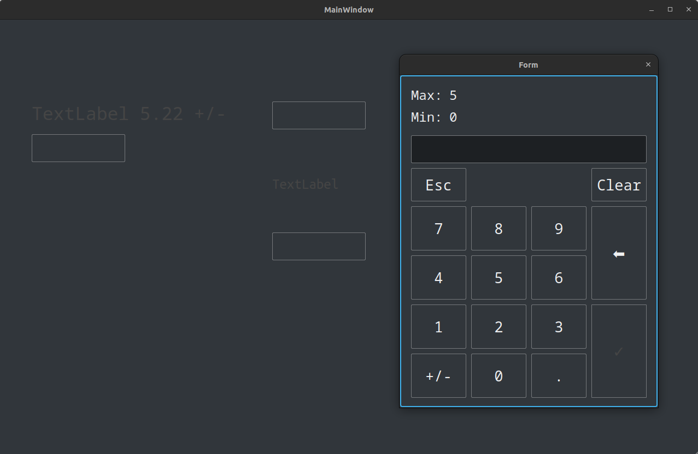

# qt-numpad

Simple dialog-based Qt numpad, modified from https://github.com/dzoka/qt-virtual-numpad. With numpad written within QDialog, it's easy to integrate with traditional Qt Widget applications.